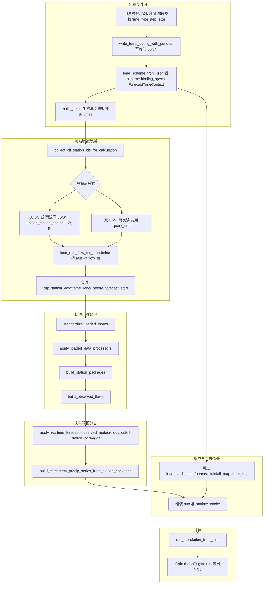
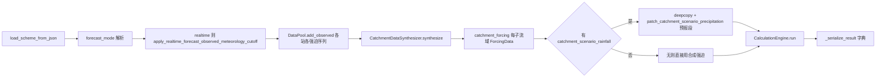
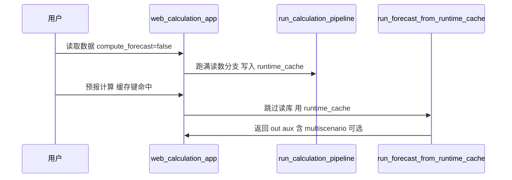

# 洪水预报系统开发手册（当前代码版）

本文档面向当前 `hydro_project` 代码，重点说明：

- 代码目录结构
- 关键文件职责（按模块）
- 对外调用入口与推荐调用方式
- 数据读取到计算的标准流程（含新预留处理层）

---

## 1. 项目分层与总览

当前工程可以按 4 层理解：

1. **核心引擎层（`hydro_engine/core`、`domain`、`engine`、`models`）**
   - 定义时间轴、序列、强迫数据、节点/河道/子流域实体与计算引擎。
2. **配置与数据拼装层（`hydro_engine/io`、`hydro_engine/read_data`）**
   - 负责 JSON 解析、数据库/文件读取、DataFrame 到引擎输入对象的转换。
3. **对外 API 层（`hydro_engine/api`）**
   - 提供 `ForecastSession` 这种稳定门面，供外部系统或上层应用调用。
4. **应用与脚本层（`scripts`）**
   - 桌面 UI、Web 调试页面、配置转换工具、率定入口等。

---

## 2. 目录结构（含关键文件）

```text
hydro_project/
├─ configs/                                      # 运行配置（方案 JSON、JDBC 配置）
├─ docs/                                         # 专题文档
├─ hydro_engine/                                 # 引擎主包
│  ├─ __init__.py                                # 包级导出（ForecastSession/Engine/Scheme）
│  ├─ api/                                       # 对外稳定 API 层
│  │  ├─ __init__.py                             # API 导出入口
│  │  └─ forecast_session.py                     # 预报会话门面（搭时轴、拉数、改数、计算、取结果）
│  ├─ calibration/                               # 率定模块
│  │  ├─ __init__.py                             # 率定导出入口
│  │  ├─ calibrator.py                           # 率定流程编排
│  │  └─ sceua.py                                # SCE-UA 算法实现
│  ├─ core/                                      # 核心基础类型层
│  │  ├─ __init__.py                             # core 导出入口
│  │  ├─ context.py                              # 时间上下文、时间类型与步长规则
│  │  ├─ timeseries.py                           # 时间序列对象与运算
│  │  ├─ forcing.py                              # 强迫类型与强迫容器
│  │  ├─ interfaces.py                           # 模型/校正接口契约
│  │  └─ data_pool.py                            # 数据池与 observed/forecast 拼接逻辑
│  ├─ domain/                                    # 领域实体层
│  │  ├─ __init__.py                             # domain 导出入口
│  │  ├─ catchment.py                            # 子流域实体
│  │  ├─ reach.py                                # 河段实体
│  │  └─ nodes/                                  # 节点实体子包
│  │     ├─ __init__.py                          # 节点导出入口
│  │     ├─ base.py                              # 节点基类与通用处理模板
│  │     ├─ cross_section.py                     # 断面节点
│  │     ├─ reservoir.py                         # 水库节点
│  │     └─ diversion.py                         # 分洪节点
│  ├─ engine/                                    # 计算执行层
│  │  ├─ __init__.py                             # engine 导出入口
│  │  ├─ scheme.py                               # 方案组织、拓扑图与顺序
│  │  └─ calculator.py                           # 计算引擎与结果对象
│  ├─ io/                                        # 配置解析与应用数据拼装层
│  │  ├─ __init__.py                             # io 对外导出入口
│  │  ├─ json_config.py                          # JSON 方案解析 + 一键计算入口
│  │  ├─ calculation_app_data_loader.py          # 应用层读数（DB/CSV、Hour/Day 源切换）
│  │  ├─ calculation_app_data_builder.py         # DataFrame -> ForcingData/TimeSeries 构建
│  │  ├─ calculation_app_data_processors.py      # 读取后标准化与可插拔处理管线（当前空处理）
│  │  └─ project_config_qa.py                    # 配置 QA 校验（静态+试运行）
│  ├─ models/                                    # 数学模型层
│  │  ├─ __init__.py                             # 模型聚合导出
│  │  ├─ runoff/                                 # 产流模型（xinanjiang/tank/snowmelt 等）
│  │  ├─ routing/                                # 汇流模型（muskingum 等）
│  │  └─ correction/                             # 误差校正模型（AR1 等）
│  ├─ processing/                                # 强迫合成与聚合流程
│  │  ├─ __init__.py                             # processing 导出入口
│  │  ├─ aggregator.py                           # 聚合算法工具
│  │  └─ pipeline.py                             # 子流域强迫合成流水线
│  ├─ forecast/                                  # 预报面雨产品与预报段强迫覆写
│  │  ├─ catchment_forecast_rainfall.py         # 单流域三情景面雨（expected/upper/lower，可选 pet）
│  │  ├─ forecast_data_manager.py               # Mock CSV / DataFrame → CatchmentForecastRainfall
│  │  ├─ scenario_forcing.py                    # 覆写子流域预报段 P（及可选 PET）；多流域 CSV 分组
│  │  └─ skeleton_pipeline.py                  # 骨架预报管线（热启动等，独立演示）
│  └─ read_data/                                 # 数据源读取层
│     ├─ __init__.py                             # 读取层导出入口
│     ├─ types.py                                # 读取协议与类型
│     ├─ file_reader.py                          # 文件读取器
│     ├─ database_reader.py                      # 数据库读取器（SQLAlchemy + SQL YAML）
│     ├─ api_reader.py                           # API 读取占位实现
│     ├─ factory.py                              # 读取器工厂与统一入口
│     └─ sql/                                    # 数据库 SQL 模板
├─ scripts/                                      # 应用与命令行入口
│  ├─ calculation_pipeline_runner.py          # Web/Service 通用计算入口（读取/组装/缓存/可选计算）
│  ├─ web_calculation_app.py                     # Streamlit 调试应用
│  ├─ calculation_app_common.py                  # 历史兼容封装
│  ├─ convert_legacy_config.py                   # 老配置转新配置工具（多 scheme）
│  ├─ config_converter_app.py                    # 配置转换 UI
│  ├─ run_sceua_calibration.py                   # 率定命令行入口
│  └─ debug_client.py                            # 本地联调入口
├─ tests/                                        # 单元/集成测试
├─ CALCULATION_LOGIC.md                          # 计算逻辑说明
├─ HANDOVER.md                                   # 交接说明
└─ DEVELOPMENT_MANUAL.md                         # 开发手册（本文）
```

---

## 3. 文件职责说明（按模块）

## 3.1 包导出与 API 门面

- `hydro_engine/__init__.py`
  - 包级聚合导出：`ForecastSession`、`ForecastingScheme`、`CalculationEngine`、`CalculationResult`。
- `hydro_engine/api/__init__.py`
  - 对外 API 子包导出入口。
- `hydro_engine/api/forecast_session.py`
  - 面向外部调用的会话门面，负责：
  - 时间轴搭建
  - 读数组织（外部 reader）
  - 人工修改强迫序列
  - 发起计算并提取结果

## 3.2 Core 基础层

- `hydro_engine/core/context.py`
  - 时间上下文、时间类型解析、分段步数到绝对时间的推导。
- `hydro_engine/core/timeseries.py`
  - 时间序列对象及基础运算、对齐规则。
- `hydro_engine/core/forcing.py`
  - 强迫类型与强迫容器（降雨、蒸发、气温等）。
- `hydro_engine/core/interfaces.py`
  - 产流/汇流/误差校正等统一接口定义。
- `hydro_engine/core/data_pool.py`
  - 数据池与序列拼接辅助（observed/forecast）。

## 3.3 Domain 领域实体层

- `hydro_engine/domain/catchment.py`
  - 子流域实体，封装产流与子流域演进行为。
- `hydro_engine/domain/reach.py`
  - 河段实体，封装河道汇流演进。
- `hydro_engine/domain/nodes/base.py`
  - 节点模板基类，含观测接力、校正等通用流程。
- `hydro_engine/domain/nodes/cross_section.py`
  - 断面节点实现。
- `hydro_engine/domain/nodes/reservoir.py`
  - 水库节点实现（调度相关参数/约束）。
- `hydro_engine/domain/nodes/diversion.py`
  - 分洪节点实现。

## 3.4 Engine 计算执行层

- `hydro_engine/engine/scheme.py`
  - 方案注册、拓扑构图、拓扑顺序输出。
- `hydro_engine/engine/calculator.py`
  - 主计算引擎与结果对象定义。

## 3.5 Models 数学模型层

- `hydro_engine/models/runoff/*.py`
  - 产流模型（如新安江、Tank、Snowmelt、Dummy）与率定边界。
- `hydro_engine/models/routing/*.py`
  - 河道演进模型（如 Muskingum、Dummy）。
- `hydro_engine/models/correction/ar1_updater.py`
  - 误差更新器实现。
- `hydro_engine/models/__init__.py`
  - 常用模型聚合导出。

## 3.6 IO 配置与应用数据拼装层

- `hydro_engine/io/json_config.py`
  - JSON 方案加载、模型对象构建、从配置一键计算入口。
  - **`apply_realtime_forecast_observed_meteorology_cutoff(station_packages, time_context=...)`**：实时预报下将各测站 **P / PET / 气温** 从 **预报起点 T0（含）** 至序列末尾置 **0**（原地修改），表示 T0 起不再使用“实测”气象强迫（与业务上“T0 为第一个预报步、该步尚无实测”一致）。
  - **`run_calculation_from_json(..., forecast_mode=...)`**：在 `forecast_mode="realtime_forecast"` 时内部调用上述截断后再入池计算；`historical_simulation` 不截断。
  - **`run_calculation_from_json(..., catchment_scenario_rainfall=..., scenario_precipitation=..., forecast_multiscenario=...)`**（关键字参数）：子流域强迫经 `CatchmentDataSynthesizer` 合成后，可按 `CatchmentForecastRainfall` 字典 **覆写预报段** 降水（及可选 PET）；`forecast_multiscenario=True` 时对 expected/upper/lower 各跑一遍引擎，主结果序列仍由 `scenario_precipitation` 决定，完整三情景见返回字典 **`multiscenario_engine_outputs`**。详见 `hydro_engine/forecast/scenario_forcing.py`。
- `hydro_engine/io/calculation_app_data_loader.py`
  - 桌面/Web/率定场景读数辅助：
  - 从 JDBC 配置或 CSV 读取测站时序；识别 Hour/Day 读取源（`HOURDB`/`DAYDB`）。
  - **`collect_rain_station_ids`**：子流域绑定中的 **降水、PET（受 `use_station_pet`）、气温** 站 id。
  - **`collect_observed_flow_station_ids`**：节点 `observed_station_id` / `observed_inflow_station_id`。
  - **`collect_all_station_ids_for_calculation(binding_specs, scheme)`**：上述集合的并集，供 **同一张库表一次 `SENID IN (...)` 查询**（与 `load_rain_flow_for_calculation` 的 `unified_station_senids` 配合）。
  - **`station_observation_query_end_realtime(time_context)`**：实时预报下库表 **`t_end`** 上界（`forecast_start_time - time_delta`，不包含 T0 及以后）；**`meteorology_station_query_end_realtime`** 为兼容别名。
  - **`clip_station_dataframe_rows_before_forecast_start`**：对读入的 DataFrame 去掉时间 **≥ T0** 的行（双 CSV 等无法带 `t_end` 截断时的兜底）。
  - **`load_rain_flow_for_calculation(..., station_table_query_end=..., unified_station_senids=..., rain_meteorology_time_end=...)`**：`station_table_query_end` 非空时 **雨/流/温共用** 该上界写 SQL `t_end`；JDBC 或「雨/流同一 JSON 库」路径下若传入 **`unified_station_senids`** 则只发 **一次** 库请求。`rain_meteorology_time_end` 仅作 **`station_table_query_end`** 的兼容别名。
- `hydro_engine/io/calculation_app_data_builder.py`
  - DataFrame 转引擎输入：
  - `build_station_packages`
  - `build_observed_flows`
  - `build_catchment_precip_series`（由 `rain_df` + `times` 按绑定加权，**校准/评估等仍可直接用**）
  - **`build_catchment_precip_series_from_station_packages`**（由已组装的 `station_packages` 按相同权重计算面雨量，**与引擎输入及 T0 截断后序列一致**）
  - 以及 `catchment_forecast` 多源融合
- `hydro_engine/io/calculation_app_data_processors.py`
  - **新拆分模块**，用于“读取后、建模前”的标准化与可插拔处理管线：
  - `standardize_loaded_inputs(...)`
  - `build_loaded_data_processors(time_type)`
  - `apply_loaded_data_processors(...)`
  - 当前默认空处理（不改变行为）
- `hydro_engine/io/project_config_qa.py`
  - 配置静态/运行期校验与问题清单输出。

## 3.7 Read Data 数据源层

- `hydro_engine/read_data/types.py`
  - 数据读取规范类型。
- `hydro_engine/read_data/file_reader.py`
  - 文件读取实现。
- `hydro_engine/read_data/database_reader.py`
  - 数据库读取实现（SQLAlchemy + 外置 SQL YAML）。
- `hydro_engine/read_data/api_reader.py`
  - API 读取占位实现。
- `hydro_engine/read_data/factory.py`
  - reader 工厂与统一读取入口。
- `hydro_engine/read_data/sql/*.yaml`
  - 各数据库方言 SQL 模板。

## 3.8 Scripts 应用入口层

- `scripts/calculation_pipeline_runner.py`
  - Web/Service 通用计算入口：
  - 读取测站数据（同库 **一次 IN**、实时 **`t_end` 截断** + CSV 时间裁剪）、拼装引擎输入（`station_packages` / `observed_flows`）、
  - 组装前端所需 aux（测站序列、子流域面雨量等），并支持 `compute_forecast` 开关与内存缓存复用。
  - **实时预报（`forecast_mode=realtime_forecast`）**：在生成 aux **之前**对 `station_packages` 做与 `run_calculation_from_json` 一致的 **T0 起气象截断**；面雨量 **`catchment_rain`** 使用 `build_catchment_precip_series_from_station_packages`，避免仍从 `rain_df` 取 T0 的“实测”显示。
  - **`runtime_cache`**：含 **`binding_specs`**、**`catchment_scenario_rainfall`**（若配置情景 CSV）、**`forecast_scenario_precipitation`**、**`forecast_run_multiscenario`** 等；供 `run_forecast_from_runtime_cache` 在计算后按修补后的包 **重写 aux**（先读数再单独点“预报计算”时与引擎输入一致）。
- `scripts/web_calculation_app.py`
  - Streamlit 调试应用入口。
- `scripts/calculation_app_common.py`
  - 历史兼容层（优先迁移到 `hydro_engine/io/*`）。
- `scripts/convert_legacy_config.py`
  - 旧配置转新配置工具（支持多 scheme）。
- `scripts/config_converter_app.py`
  - 配置转换 UI（Streamlit）。
- `scripts/run_sceua_calibration.py`
  - 率定命令行入口。
- `scripts/debug_client.py`
  - 联调脚本入口。

---

## 4. 对外调用方法（重点）

## 4.1 Python 包级导出（推荐）

```python
from hydro_engine import ForecastSession, ForecastingScheme, CalculationEngine, CalculationResult
```

## 4.2 `ForecastSession`（推荐上层调用）

主要公开方法（`hydro_engine/api/forecast_session.py`）：

- `setup_time_axis(...)`
- `fetch_data_from_source(...)`
- `get_forcing_series(...)`
- `modify_forcing_series(...)`
- `run_calculation(...)`
- `get_node_hydrograph(...)`
- `get_catchment_hydrograph(...)`
- `get_status()`

适用场景：上层业务系统、二次开发平台、服务 API 封装。

## 4.3 `json_config` 直接调用（引擎级）

`hydro_engine/io/json_config.py` 的关键函数：

- `load_scheme_from_json(...)`
- `apply_realtime_forecast_observed_meteorology_cutoff(...)`（实时预报 T0 起气象截断，与 `run_calculation_from_json` 内逻辑一致时可单独复用）
- `run_calculation_from_json(..., forecast_mode=..., catchment_scenario_rainfall=..., scenario_precipitation=..., forecast_multiscenario=...)`（后三项为关键字参数，默认不注入情景面雨）
- `build_catchment_forcing_from_station_packages(...)`

适用场景：需要精细控制输入对象、绕过 UI 直接运行计算。

## 4.4 通用计算入口（Web/Service）

`scripts/calculation_pipeline_runner.py` 关键流程函数：

- `run_calculation_pipeline(..., forecast_scenario_rain_csv=..., forecast_scenario_default_catchment_ids=..., forecast_scenario_precipitation=..., forecast_run_multiscenario=...)`：完整流程（读数 + 拼装 + 可选计算）；实时预报下 aux 与引擎强迫对齐（见 §5）；可选加载情景面雨 CSV 写入 `runtime_cache` 并传入 `run_calculation_from_json`。
- `run_forecast_from_runtime_cache(...)`：使用内存缓存直接计算；实时预报下在 `run_calculation_from_json` **之后**按当前 `station_packages` 重建 `station_precip` / `station_pet` / `station_temp` / `catchment_rain` 并回写 `runtime_cache["aux_base"]`；情景主结果/三情景参数由调用方传入并与缓存内 `catchment_scenario_rainfall` 配合。

---

## 5. 读取数据到计算的标准流程（当前实现）

**数据流总览、泳道与引擎内部放大图见下文 §5.4。**

以通用 pipeline 主流程为例（`run_calculation_pipeline`）：

1. 解析时间轴并生成 `times`
2. 收集测站 ID：**`collect_all_station_ids_for_calculation`**（雨/PET/气温绑定 + 节点流量/入流）；兼容路径仍保留 `collect_rain_station_ids` / `collect_observed_flow_station_ids` 分项日志。
3. 解析当前方案 `dbtype`（`-1` 前时标，`0` 后时标）：
   - 预报起报时刻保持与 UI/配置输入一致（不再因 `dbtype` 额外平移）
   - 前后时标差异通过“读窗/标签/整编锚点”链路处理
   然后据此回推 `warmup_start_time`。
3. **`load_rain_flow_for_calculation`**：若 `forecast_mode=realtime_forecast`，则 **`station_table_query_end = station_observation_query_end_realtime(time_context)`**，使库表 **`t_end`** 不包含 T0 及以后（雨、流、温同一上界）；JDBC 或「雨/流同一 JSON 库」时传入 **`unified_station_senids=collect_all...`**，**一次 `IN` 查询** 拉全站。双 CSV 时仍两次读文件，但 **`time_end` 同为截断上界**；随后对 `rain_df` / `flow_df`（若非同一引用则分别）调用 **`clip_station_dataframe_rows_before_forecast_start`**，去掉 **≥ T0** 行。
4. **前时标读数窗口平移与标签回拨**（`dbtype=-1`）：
   - 读库窗口整体前移 1 步：`read_start/read_end/station_table_query_end += time_delta`
   - 读完后将 `TIME_DT/TIME` 标签统一回拨 1 步（`-time_delta`）
   - 目的：与历史 Java 逻辑一致，避免末端漏读后被 `interp` 复制前值（常见现象：最后实测值与前一时刻相同）。
4. 调用 `standardize_loaded_inputs(...)` 标准化读取结果
5. 调用 `apply_loaded_data_processors(...)` 执行预留处理管线（当前默认空处理）
6. 调用 `build_station_packages(...)`、`build_observed_flows(...)` 构造引擎输入
7. **若 `forecast_mode=realtime_forecast`**：调用 `apply_realtime_forecast_observed_meteorology_cutoff(station_packages, time_context)`（T0 及之后 P/PET/气温置 0），保证 **仅读取数据**（`compute_forecast=False`）时前端展示的测站/面雨量也不误用 T0“实测”）
8. 调用 `build_catchment_precip_series_from_station_packages(...)` 生成 **`catchment_rain`**（与 `station_packages` 一致）
9. 组装 `aux`（`station_precip` / `station_pet` / `station_temp` / `catchment_rain` 等）并写入 **`runtime_cache`**（含 **`binding_specs`**）
10. 若 `compute_forecast=True`：调用 `run_calculation_from_json(...)`；其中实时模式会再次对 `station_packages` 做同一截断（幂等）
11. （可选）若配置了预报情景面雨 CSV：读入 **`catchment_scenario_rainfall`** 写入 `runtime_cache`，计算时传入 `run_calculation_from_json`；CSV 首时刻须与 **`forecast_start_time`** 对齐，步长与预报段步数一致（见 `scenario_forcing.py` 文档字符串）。

**说明**：率定等路径若仍用 `build_catchment_precip_series(rain_df, ...)` 而不经过上述截断，行为与“未做实时业务约束”的原始库表一致，属预期差异。Web 通用入口以 `station_packages` 为准对齐引擎。

### 5.5 前后时标配置约定（Python 版）

- 配置位置：`schemes[].dbtype`
- 语义约定（保持与旧系统一致）：
  - `dbtype=-1`：前时标
  - `dbtype=0`：后时标
- 兼容说明：当前实现默认读取小写 `dbtype`；未配置时按前时标处理。
- Web 侧栏会以“当前时标模式（只读展示）”显示匹配 `time_type + step_size` 的 `dbtype`。
- 预报面雨特例（`WEA_GFSFORRAIN`）：
  - 源表语义固定为前时标（`BTIME=t, TIMESPAN=1` 表示 `t~t+1` 累计雨量）
  - 当方案为后时标时，仅在整编锚点阶段做一次“前时标 -> 后时标”映射
  - 对齐/展示层不再做二次平移，避免前后错位一格。

### 5.1 新增处理层说明

`hydro_engine/io/calculation_app_data_processors.py` 当前目标是提供稳定扩展点：

- 不改动现有业务行为
- 未来可在此挂接质量控制、缺测处理、异常值处理、规则修正等算法
- 可按 `time_type` 构建不同处理链

### 5.2 实时预报：为何库表也要截断到 T0 之前

仅依赖 `apply_realtime_forecast_observed_meteorology_cutoff` 置零，仍可能在「回算历史某 T0」时从库中读到 **T0 之后才入库的实况**，与当时业务可获信息不一致。当前约定：**实时模式读库 `t_end` 与全站类型一致**，避免拉取 T0 后的任何测站记录；无预报面雨时预报段强迫仍由截断/合成得到 **0** 或由 **情景 CSV 覆写**。

### 5.3 预报情景面雨（可选）

- **入口**：`hydro_engine/forecast/scenario_forcing.py` 的 `load_catchment_forecast_rainfall_map_from_csv`、`patch_catchment_scenario_precipitation`。
- **串联**：`run_calculation_from_json` 在合成 `catchment_forcing` 后 `deepcopy` 再覆写 **预报段**；Web/pipeline 通过 `forecast_scenario_rain_csv` 等参数加载并缓存。
- **CSV 列**：`time`、`expected`、`upper`、`lower`；可选 `pet`；可选 **`catchment_id`** 多流域（无该列时须在 UI/参数中指定唯一子流域 id）。

### 5.4 数据流程详解

本节从「谁调谁、数据长什么样、在何处分叉」梳理 **Web / `calculation_pipeline_runner`** 与 **`run_calculation_from_json`** 的串联，便于排查读数与强迫不一致问题。

#### 5.4.1 分层与职责边界

| 层 | 典型模块 | 职责 |
|----|-----------|------|
| **应用脚本** | `scripts/calculation_pipeline_runner.py`、`scripts/web_calculation_app.py` | 写临时方案 JSON、调 `load_scheme_from_json`、**一次/多次读库**、组 `times`、`station_packages`、`observed_flows`、`aux`、`runtime_cache`；可选只读数不计算。 |
| **读数 / 拼装** | `calculation_app_data_loader.py`、`calculation_app_data_builder.py`、`calculation_app_data_processors.py` | DataFrame ↔ 站包 / 实测流量；实时下 **`t_end` 截断**、**`unified_station_senids`**、CSV **时间裁剪**；标准化占位管线。 |
| **配置与一键算** | `json_config.py` | 再加载方案、`forecast_mode`、**气象截断**、**`DataPool` + `CatchmentDataSynthesizer`**、可选 **情景面雨覆写**、**`CalculationEngine.run`**、结果序列化。 |
| **引擎与领域** | `engine/calculator.py`、`domain/*`、`processing/pipeline.py` | 拓扑调度、子流域产流与汇流、节点水库/分流、实测接力等。 |

#### 5.4.2 端到端主流程（从配置到结果）



说明：**子图「实时预报分支」**（R1/R2）仅在 **`forecast_mode=realtime_forecast`** 时执行；历史模拟下 C4 后直接进入组装缓存（可视为跳过 R1/R2）。**`B4`** 仅在实时模式且 DataFrame 含可解析时间列时执行。**`D2`** 在 pipeline 读数阶段即可执行，结果写入 `runtime_cache`，计算阶段传入 `E1`。

#### 5.4.3 `run_calculation_from_json` 内部（与 pipeline 的关系）

Pipeline 已组好 **`station_packages`**、**`observed_flows`** 并（实时）已截断时，`run_calculation_from_json` **会再次** `load_scheme_from_json`（保证与磁盘临时配置一致），然后：



若 **`forecast_multiscenario=True`** 且情景字典非空：对 **expected / upper / lower** 各执行一次 **`S7a→S8→部分序列化`**，主返回仍取 **`scenario_precipitation`** 对应那次；三份完整序列化结果挂在 **`multiscenario_engine_outputs`**。

#### 5.4.4 实时预报 vs 历史模拟（读数与截断）

| 环节 | `realtime_forecast` | `historical_simulation` |
|------|---------------------|-------------------------|
| 库表 **`t_end`** | **`station_observation_query_end_realtime`**（不含 T0 及以后） | **`time_context.end_time`**（全时段） |
| CSV 行裁剪 | **`clip_station_dataframe_rows_before_forecast_start`**（去掉 ≥T0） | 一般不裁（`station_table_query_end` 为空） |
| **`station_packages` 截断** | T0 起 P/PET/气温 **置 0**（pipeline 与 `run_calculation_from_json` 各一次，幂等） | **不截断** |
| 预报段面雨来源 | 合成（截断后多为 0）或 **情景 CSV 覆写** | 合成或情景覆写；站网实况可贯穿全时段 |

#### 5.4.5 `runtime_cache` 中与数据流相关的键

| 键 | 含义 |
|----|------|
| `config_used_path` | 带四段步数的临时方案路径，计算与读数共用。 |
| `warmup_start_time` | 预热段起点，与 `time_context.warmup_start_time` 一致。 |
| `binding_specs` | 子流域站绑定；用于从 `station_packages` 重算 `catchment_rain`、二次预报时对齐。 |
| `station_packages` / `observed_flows` | 引擎输入；实时下可能已被截断。 |
| `time_context` / `times` | 时间轴与步数上下文。 |
| `catchment_scenario_rainfall` | 可选；`Dict[catchment_id, CatchmentForecastRainfall]`。 |
| `forecast_scenario_precipitation` / `forecast_run_multiscenario` | 与 Web 二次计算传入一致，便于缓存分支。 |
| `aux_base` | 图表用序列快照；`run_forecast_from_runtime_cache` 在实时下可回写其中雨量相关字段。 |

#### 5.4.6 Web 两阶段与缓存复用



**缓存键**（`_cache_key_from_params`）包含：配置路径、JDBC、雨/流 CSV、起报时间、**四段步数**、**情景 CSV 路径**、**默认子流域 id 列表**；**不包含**「主降水情景 / 是否三情景」，便于只改情景再点「预报计算」仍命中读数缓存。

#### 5.4.7 与 `ForecastSession` 的关系

**`hydro_engine/api/forecast_session.py`** 可走另一套「外部 reader」组织数据；本文 §5 / §5.4 描述的是 **Streamlit + `calculation_pipeline_runner` + `run_calculation_from_json`** 主路径。业务若接 `ForecastSession`，应在读数阶段自行保证与上表一致的 **实时截断语义**，或在入池前调用相同的 **`apply_realtime_forecast_observed_meteorology_cutoff`** 与情景覆写逻辑。

---

## 6. 配置与数据文件

## 6.1 关键配置文件

- `configs/forecastSchemeConf.json`
  - 预报方案主配置（可含多个 `schemes`）。
- `configs/floodForecastJdbc.json`
  - JDBC 服务配置（数据库连接与服务名）。
  - 日表（`daydb_*` SQL）可选块 `daydb.normalize_time_to_midnight`：为 `true` 时读库后将 `TIME_DT` 归一到当日 `00:00:00`，与引擎日方案时间网格对齐。

## 6.2 SQL 模板

- `hydro_engine/read_data/sql/dameng.yaml`
  - 达梦 SQL 模板（含小时与逐日查询键）。
- `hydro_engine/read_data/sql/mysql.yaml`
  - MySQL SQL 模板。

---

## 7. 测试与验证建议

- 单元/集成测试目录：`tests/`
- 重点用例：
  - `test_json_config_pipeline.py`（含实时截断时刻、情景面雨多情景）
  - `test_forecast_skeleton_pipeline.py`
  - `test_catchment_forecast_fusion.py`
  - `test_node_observed_routing.py`
  - `test_reservoir_*`
  - `test_rolling_forecast_eval.py`

建议每次结构性改动后至少验证：

1. 配置加载流程（`load_scheme_from_json`）
2. 读取与拼装流程（`calculation_app_data_loader/builder/processors`）
3. 一次完整计算流程（桌面或脚本入口）

---

## 8. 二次开发建议

- 对外接口优先走 `ForecastSession`，减少上层对内部结构的耦合。
- 读取后预处理算法统一接入 `calculation_app_data_processors.py`。
- 新模型优先遵循 `core/interfaces.py`，并在 `json_config.py` 做注册映射。
- 新节点类型优先放在 `domain/nodes`，并在 `json_config.py` 增加构建分支。
- 保持“配置解析层”和“UI 层”职责分离，避免业务逻辑散落到脚本 UI 代码。

---

## 9. 本手册维护规则

发生以下变更时必须同步更新本文档：

- 新增/删除模块文件
- 对外方法签名变化
- 读取流程阶段变化（尤其是处理管线）
- **实时预报与 `aux`/引擎强迫对齐语义**（T0、截断、`runtime_cache` 字段）
- **数据流程详图与表**（§5.4：分层、`runtime_cache`、Web 缓存键、与 `ForecastSession` 关系）
- **测站读库策略**（`station_table_query_end`、`unified_station_senids`、气温纳入 `collect_rain_station_ids`）
- **预报情景面雨**（`run_calculation_from_json` 关键字参数、`scenario_forcing`、`web`/`pipeline` 参数名）
- 配置文件结构变化（`schemes`、bindings、JDBC、SQL key）

---

## 10. `.py` 文件功能总览（按目录）

以下为当前主要 Python 文件的一句话定位，便于快速索引代码。

### 10.1 `hydro_engine/`

- `hydro_engine/__init__.py`：包级导出（`ForecastSession`、`ForecastingScheme`、`CalculationEngine` 等）。

### 10.2 `hydro_engine/api/`

- `hydro_engine/api/__init__.py`：API 层导出入口。
- `hydro_engine/api/forecast_session.py`：预报会话门面（时间轴、读数、改数、计算、结果提取）。

### 10.3 `hydro_engine/calibration/`

- `hydro_engine/calibration/__init__.py`：率定模块导出入口。
- `hydro_engine/calibration/calibrator.py`：率定流程编排与目标函数驱动。
- `hydro_engine/calibration/sceua.py`：SCE-UA 算法实现。

### 10.4 `hydro_engine/core/`

- `hydro_engine/core/__init__.py`：core 层聚合导出。
- `hydro_engine/core/context.py`：时间上下文与时间类型/步长规则。
- `hydro_engine/core/timeseries.py`：统一时间序列对象与运算。
- `hydro_engine/core/forcing.py`：强迫类型枚举与强迫数据容器。
- `hydro_engine/core/interfaces.py`：产流/汇流/校正接口契约。
- `hydro_engine/core/data_pool.py`：观测/预报序列数据池与拼接逻辑。

### 10.5 `hydro_engine/domain/`

- `hydro_engine/domain/__init__.py`：domain 层导出入口。
- `hydro_engine/domain/catchment.py`：子流域实体与产流/汇流封装。
- `hydro_engine/domain/reach.py`：河段实体与路由封装。
- `hydro_engine/domain/nodes/__init__.py`：节点子包导出。
- `hydro_engine/domain/nodes/base.py`：节点基类与通用处理模板。
- `hydro_engine/domain/nodes/cross_section.py`：断面节点实现。
- `hydro_engine/domain/nodes/reservoir.py`：水库节点实现（调度约束等）。
- `hydro_engine/domain/nodes/diversion.py`：分洪节点实现。

### 10.6 `hydro_engine/engine/`

- `hydro_engine/engine/__init__.py`：engine 层导出入口。
- `hydro_engine/engine/scheme.py`：方案对象、拓扑图与顺序组织。
- `hydro_engine/engine/calculator.py`：核心计算引擎与结果对象。

### 10.6b `hydro_engine/forecast/`

- `hydro_engine/forecast/catchment_forecast_rainfall.py`：单流域预报面雨三情景 + 可选 `pet` 与校验。
- `hydro_engine/forecast/forecast_data_manager.py`：Mock CSV / DataFrame 转 `CatchmentForecastRainfall`。
- `hydro_engine/forecast/scenario_forcing.py`：`patch_catchment_scenario_precipitation`、`load_catchment_forecast_rainfall_map_from_csv`（与 `run_calculation_from_json` 串联）。
- `hydro_engine/forecast/skeleton_pipeline.py`：实况末态 + Mock 面雨的骨架演示管线。
- `hydro_engine/forecast/__init__.py`：对外导出上述符号。

### 10.7 `hydro_engine/io/`

- `hydro_engine/io/__init__.py`：io 层对外导出。
- `hydro_engine/io/json_config.py`：JSON 方案解析与一键计算入口；含实时预报气象截断、情景面雨覆写与多情景引擎输出。
- `hydro_engine/io/calculation_app_data_loader.py`：应用层数据读取（DB/CSV、Hour/Day 源切换；实时截断 `t_end`、全站并集一次查询、CSV 时间裁剪）。
- `hydro_engine/io/calculation_app_data_builder.py`：DataFrame 转 `ForcingData/TimeSeries` 与融合构建；含 `build_catchment_precip_series_from_station_packages`。
- `hydro_engine/io/calculation_app_data_processors.py`：读取后标准化与可插拔处理管线（当前空处理）。
- `hydro_engine/io/project_config_qa.py`：项目配置 QA 校验（静态+试运行）。

### 10.8 `hydro_engine/models/`

- `hydro_engine/models/__init__.py`：模型层聚合导出。
- `hydro_engine/models/runoff/__init__.py`：产流模型导出。
- `hydro_engine/models/runoff/dummy.py`：占位产流模型。
- `hydro_engine/models/runoff/xinanjiang.py`：新安江产流模型。
- `hydro_engine/models/runoff/xinanjiang_cs.py`：新安江 CS 变体模型。
- `hydro_engine/models/runoff/tank.py`：Tank 产流模型。
- `hydro_engine/models/runoff/snowmelt.py`：融雪相关产流模型。
- `hydro_engine/models/runoff/calibration_bounds.py`：率定参数边界定义。
- `hydro_engine/models/routing/__init__.py`：汇流模型导出。
- `hydro_engine/models/routing/dummy.py`：占位汇流模型。
- `hydro_engine/models/routing/muskingum.py`：Muskingum 汇流模型。
- `hydro_engine/models/correction/__init__.py`：误差校正模型导出。
- `hydro_engine/models/correction/ar1_updater.py`：AR(1) 误差更新器。

### 10.9 `hydro_engine/processing/`

- `hydro_engine/processing/__init__.py`：processing 层导出。
- `hydro_engine/processing/aggregator.py`：多站聚合与统计工具。
- `hydro_engine/processing/pipeline.py`：子流域强迫数据合成流水线。

### 10.10 `hydro_engine/read_data/`

- `hydro_engine/read_data/__init__.py`：读取层导出入口。
- `hydro_engine/read_data/types.py`：读取协议与类型定义。
- `hydro_engine/read_data/file_reader.py`：文件型数据读取器。
- `hydro_engine/read_data/database_reader.py`：数据库读取器与 SQL 模板执行。
- `hydro_engine/read_data/api_reader.py`：API 读取占位实现。
- `hydro_engine/read_data/factory.py`：读取器工厂与统一入口。

### 10.11 `scripts/`

- `scripts/calculation_pipeline_runner.py`：Web/Service 通用计算入口（读数、拼装、实时预报 **库表 `t_end` 与全站一次 IN**、T0 截断与 aux 对齐、`runtime_cache` 含 `binding_specs` 与情景面雨参数、缓存复用、可选计算）。
- `scripts/web_calculation_app.py`：Streamlit 计算调试页面（含预报情景面雨 CSV、主情景、三情景开关与缓存键策略）。
- `scripts/calculation_app_common.py`：历史兼容封装（逐步迁移到 `hydro_engine/io`）。
- `scripts/convert_legacy_config.py`：旧配置转新配置（支持多 scheme）。
- `scripts/config_converter_app.py`：配置转换 UI。
- `scripts/run_sceua_calibration.py`：率定命令行入口。
- `scripts/debug_client.py`：本地调试运行入口。

### 10.12 `tests/`

- `tests/__init__.py`：测试包标识。
- `tests/_sys_path.py`：测试时补齐项目路径。
- `tests/test_json_config_pipeline.py`：配置解析+计算链路回归测试。
- `tests/test_catchment_forecast_fusion.py`：多源面预报融合逻辑测试。
- `tests/test_y_shape_basin.py`：Y 型流域拓扑与汇流测试。
- `tests/test_hydrological_models.py`：水文模型行为测试。
- `tests/test_runoff_framework.py`：产流框架契约测试。
- `tests/test_calibration_bounds.py`：率定边界一致性测试。
- `tests/test_data_pool.py`：数据池逻辑测试。
- `tests/test_catchment_synthesizer.py`：子流域强迫合成测试。
- `tests/test_catchment_routing_to_downstream.py`：子流域到下游节点注入测试。
- `tests/test_node_observed_routing.py`：节点观测接力逻辑测试。
- `tests/test_history_skip_reservoir.py`：历史阶段水库处理行为测试。
- `tests/test_reservoir_dispatch_model.py`：水库调度模型测试。
- `tests/test_reservoir_inflow_forecast_override.py`：水库入库预报覆盖测试。
- `tests/test_rolling_forecast_eval.py`：滚动预报评估测试。

---

## 11. 数据结构调整说明（2026-04）

本节汇总 2026-04 期间对“配置结构 + 运行期数据结构”的统一化改造。目标：

- 减少双向冗余，降低配置维护成本
- 将数据库连接/表策略与预报方案业务参数解耦
- 为集合预报与向量化计算统一时序载体

### 11.1 `TimeSeries` NumPy 化

- 文件：`hydro_engine/core/timeseries.py`
- 变更：
  - `values` 从 `List[float]` 升级为 `np.ndarray`
  - 形状约定：
    - 确定性：`(time_steps,)`
    - 集合：`(num_scenarios, time_steps)`
  - 增加 `time_steps`、`num_scenarios`、`is_ensemble`
- 影响：
  - 序列长度判断统一使用 `series.time_steps`
  - JSON/UI 输出前统一 `tolist()`

### 11.2 拓扑单一真相：仅在 `reaches` 定义连接关系

- 文件：`hydro_engine/io/json_config.py`、`scripts/convert_legacy_config.py`
- 变更：
  - 配置不再要求 `nodes[].incoming_reach_ids/outgoing_reach_ids`
  - 运行时根据 `reaches[].upstream_node_id/downstream_node_id` 自动回填节点入/出边
  - 转换脚本输出中不再写节点 `incoming/outgoing` 冗余字段

### 11.3 预报雨数据库参数迁移到 JDBC 配置

- 文件：`hydro_engine/forecast/multisource_areal_rainfall.py`、`scripts/calculation_pipeline_runner.py`
- 变更：
  - 删除方案内 `future_rainfall.db` 读取
  - 统一从 `configs/floodForecastJdbc.json` 的 `forecast_rain` 读取：
    - `service_name`
    - `table_name`
    - `prefer_two_step_latest`

### 11.4 预报源选择去重：只认 `selected_source_name`

- 文件：`hydro_engine/forecast/multisource_areal_rainfall.py`
- 变更：
  - 不再使用 source 下的 `is_select/isSelect`
  - 统一由 `future_rainfall.selected_source_name` 选择源
  - 若指定名称不在 `sources[].name` 中，加载时报错

### 11.5 站点目录精简

- 配置：`configs/forecastSchemeConf.json`（及转换脚本同步）
- 变更：
  - `stations.rain_gauges[*].unit` 移除（雨量默认单位为 mm）
  - `stations.reservoir` 移除（与 `nodes[].station_binding` 重复）
  - `scripts/convert_legacy_config.py` 不再生成上述冗余字段
- 保留：
  - 计算所需的入库/出库/水位站绑定仍在 `nodes[].station_binding`

### 11.6 工具统一

- 新增：`hydro_engine/io/scheme_config_utils.py`
  - scheme 读取、精确匹配、默认步长选择、catalog 名称提取集中复用
- `hydro_engine/core/context.py` 增加 `native_time_delta(...)`
  - 统一 `time_type + step_size -> timedelta` 实现
